# **BUKU PANDUAN PENGGUNAAN WEBSITE SIMAQ**

## **Sistem Informasi Akademik MA Takhassus Al-Qur'an Wonosobo**

### Pendahuluan

Dokumen ini merupakan panduan resmi penggunaan Sistem Informasi Akademik (SIMAQ) yang disusun secara terstruktur dan komprehensif untuk seluruh pengguna di lingkungan MA Takhassus Al-Qur'an Wonosobo.
Panduan ini memuat penjelasan lengkap mengenai tata cara pengoperasian sistem sesuai dengan peran dan hak akses masing-masing pengguna, yaitu Admin, Guru, dan Siswa. Setiap bagian disajikan secara sistematis agar mudah dipahami dan dapat diimplementasikan secara efektif.
Dokumen ini bertujuan untuk membantu pengguna dalam memanfaatkan seluruh fitur SIMAQ secara optimal guna mendukung proses pembelajaran serta pengelolaan administrasi akademik yang lebih efisien, terintegrasi, dan terdokumentasi dengan baik.

## **Daftar Isi**

1. [Perangkat dan Persiapan](#1-perangkat-dan-persiapan)
2. [Akses Website](#2-akses-website)
3. [Prosedur Login](#3-prosedur-login)
4. [Prosedur Lupa Password dan Ganti Password](#4-prosedur-lupa-password-dan-ganti-password)
5. [Navigasi dan Struktur Menu](#5-navigasi-dan-struktur-menu)
6. [Prosedur Umum Pengelolaan Data](#6-prosedur-umum-pengelolaan-data)
7. [Panduan Berdasarkan Peran Pengguna](#7-panduan-berdasarkan-peran-pengguna)
8. [Prosedur Logout](#8-prosedur-logout)
9. [Bantuan dan Dukungan Teknis](#9-bantuan-dan-dukungan-teknis)


## **1. Perangkat dan Persiapan**

Sebelum mengakses Sistem SIMAQ, pastikan telah memenuhi persyaratan teknis berikut:

1. **Perangkat**: Gunakan perangkat komputer desktop, laptop, atau ponsel pintar (smartphone).

2. **Koneksi Internet**: Pastikan perangkat terhubung dengan koneksi internet yang stabil dan memiliki kecepatan yang cukup untuk mengakses aplikasi web.

3. **Peramban Web (Browser)**: Gunakan salah satu peramban web yang direkomendasikan:
   * Google Chrome (versi terbaru)
   * Microsoft Edge (versi terbaru)
   * Mozilla Firefox (versi terbaru)

4. **Akun Pengguna**: Pastikan telah menerima akun pengguna yang terdiri dari:
   * Alamat email (username login)
   * Kata sandi awal (password)
   
   > **Catatan**: Akun pengguna akan diberikan oleh Pihak Sekolah melalui Admin atau Tim IT.

## **2. Akses Website**

Untuk mengakses Sistem SIMAQ, ikuti langkah-langkah berikut:

1. Buka peramban web (browser) yang sudah terinstal di perangkat.

2. Pada kolom URL di bagian atas peramban, ketikkan alamat website berikut:
   ```
   https://mataqwsb.sch.id/login
   ```

3. Tekan tombol **Enter** pada keyboard.

4. Sistem akan memuat halaman Login SIMAQ. Tunggu beberapa saat hingga halaman dimuat sepenuhnya.

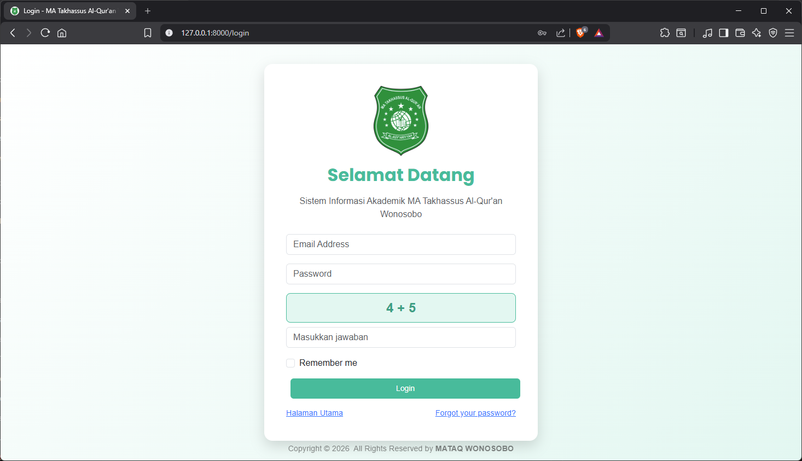
*Gambar 1: Tamilan Halaman Login SIMAQ*

## **3. Prosedur Login**

Untuk masuk ke Sistem SIMAQ, ikuti prosedur berikut:

1. Pada halaman Login SIMAQ, masukkan **Alamat Email** pada kolom yang tersedia. Email ini merupakan username yang telah diberikan oleh sekolah.

2. Masukkan **Kata Sandi (Password)** pada kolom yang tersedia. Password dimulai dengan kata sandi awal yang diberikan oleh sekolah (dapat diubah kemudian melalui halaman Profil).

3. Klik tombol **Masuk** untuk melakukan autentikasi.

4. Sistem akan memverifikasi kredensial yang dimasukkan. Jika data benar, pengguna akan diarahkan ke halaman **Dashboard** sesuai dengan peran atau hak akses yang dimiliki:
   * **Admin** → Dashboard Admin
   * **Guru** → Dashboard Guru
   * **Siswa** → Dashboard Siswa

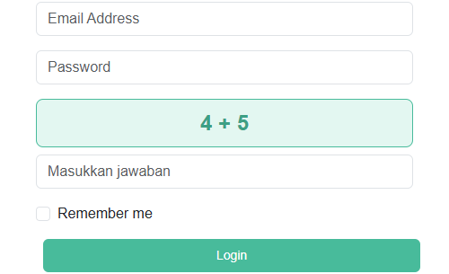
*Gambar 2: Formulir Login SIMAQ*

> **Catatan Keamanan**:
> - Jangan membagikan password kepada orang lain.
> - Selalu gunakan koneksi internet yang aman.
> - Logout setelah selesai menggunakan sistem, terutama pada komputer publik.

## **4. Prosedur Lupa Password dan Ganti Password**

### **4.1. Prosedur Lupa Password (Reset Password)**

Jika pengguna lupa kata sandi, sistem menyediakan fitur pemulihan password melalui verifikasi email. Ikuti langkah-langkah berikut:

**Langkah-Langkah Reset Password:**

1. Pada halaman **Login**, klik tautan hyperlink **Lupa Password?** yang terletak di bawah formulir atau pada bagian bawah halaman.

2. Sistem akan mengarahkan ke halaman pemulihan password:
   ```
   https://mataqwsb.sch.id/forgot-password
   ```

3. Masukkan **Alamat Email** yang terdaftar pada sistem SIMAQ di kolom yang tersedia.

4. Klik tombol **Kirim Link Reset Password**.

5. Sistem akan mengirimkan email verifikasi ke alamat email yang diinputkan. Periksa folder **Inbox** atau **Spam/Junk** pada akun email terkait.

6. Buka email dari sistem SIMAQ dengan subjek yang sesuai (biasanya: "Password Reset Link" atau sejenisnya) dan klik tautan **reset password** yang disertakan.

7. Halaman form reset password akan terbuka. Masukkan:
   * **Password Baru**: Kata sandi baru yang diinginkan (minimal 8 karakter, kombinasi huruf, angka, dan simbol direkomendasikan).
   * **Konfirmasi Password**: Ulangi password baru yang sama untuk verifikasi.

8. Klik tombol **Reset Password** untuk menyimpan perubahan.

9. Sistem akan menampilkan pesan konfirmasi bahwa password telah berhasil direset.

10. Gunakan **password baru** untuk login ke Sistem SIMAQ.

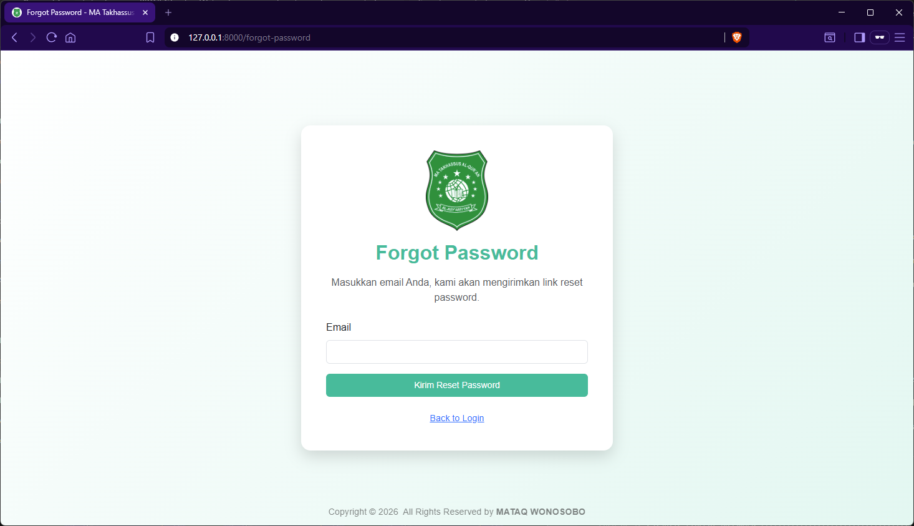
*Gambar 3: Halaman lupa Password*

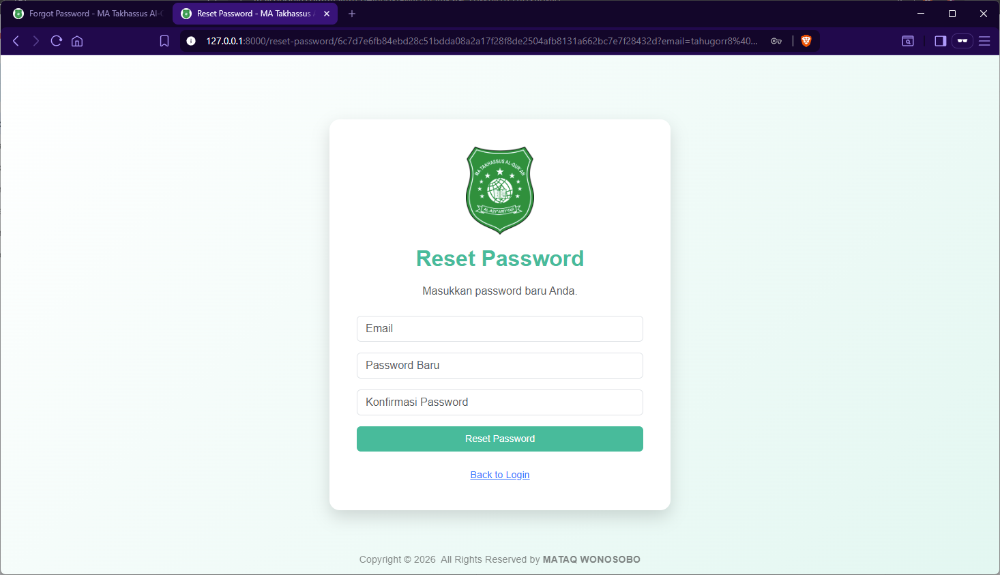
*Gambar 4: Form Input Password Baru*

> **Catatan Penting**:
> - Tautan reset password berlaku dalam waktu terbatas (biasanya 60 menit). Jika tautan sudah kadaluarsa, ulangi proses dari awal.
> - Jika tidak menerima email, periksa folder **Spam** atau **Junk** pada akun email.
> - Jika masih mengalami kendala, segera hubungi **Admin Sekolah** atau **Tim IT**.

### **4.2. Prosedur Ganti Password (Saat Login)**

Pengguna yang sudah login dapat mengubah password melalui halaman **Profil** di navbar. Ikuti langkah-langkah berikut:

**Langkah-Langkah Mengubah Password:**

1. Setelah login ke Sistem SIMAQ, cari menu **Profil** yang biasanya terletak di navbar (bagian atas halaman) atau di sidebar sebelah kiri.

2. Klik menu **Profil**. Halaman profil pengguna akan terbuka.

3. Pada halaman profil, cari bagian form **Ubah Password** atau **Change Password**.

4. Isi kolom **Password Lama** dengan password yang sedang digunakan saat ini (untuk verifikasi keamanan).

5. Isi kolom **Password Baru** dengan password baru yang diinginkan.

6. Ulangi password baru pada kolom **Konfirmasi Password Baru** untuk memastikan tidak ada kesalahan pengetikan.

7. Klik tombol **Simpan** atau **Perbarui** untuk menyimpan perubahan password.

8. Sistem akan menampilkan pesan konfirmasi bahwa password berhasil diubah.

9. Password lama sudah tidak berlaku lagi. Gunakan **password baru** untuk login berikutnya.

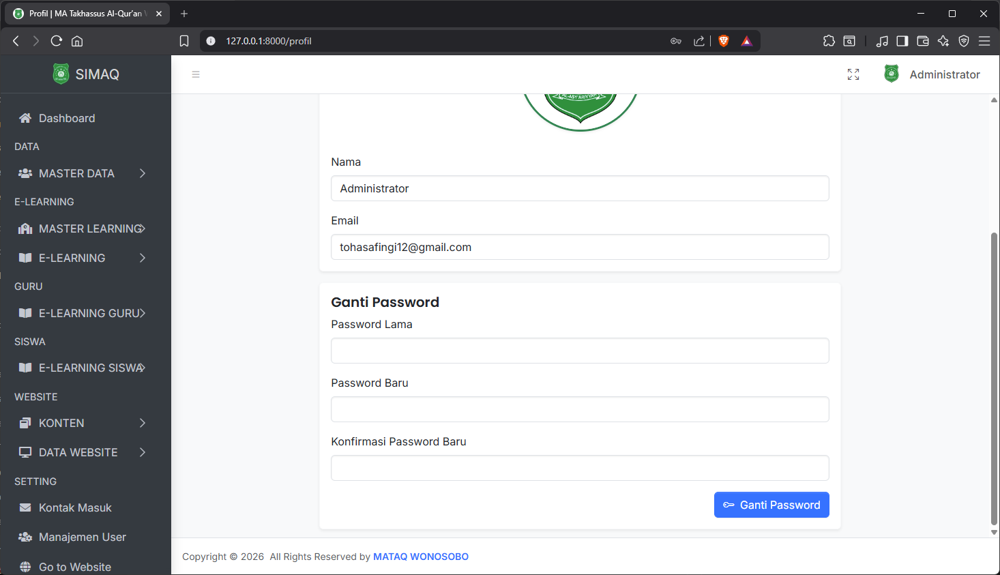
*Gambar 5: Halaman Profil dan Form Ganti Password*

> **Rekomendasi Keamanan**:
> - Gunakan password yang kuat (kombinasi huruf besar, huruf kecil, angka, dan simbol).
> - Ubah password secara berkala (setiap 3-6 bulan).
> - Jangan gunakan password yang sama untuk akun lain.
> - Jangan catat atau bagikan password kepada orang lain.

## **5. Navigasi dan Struktur Menu**

Setelah berhasil login, pengguna akan masuk ke halaman Dashboard dengan navigasi menu sebagai berikut:

### **Komponen Navigasi Utama**

1. **Sidebar (Menu Navigasi Utama)**: Menu navigasi utama terletak di sisi kiri layar. Sidebar berisi semua menu tersegmentasi sesuai fungsi dan hak akses pengguna.

2. **Struktur Menu**: 
   * Setiap menu dikelompokkan berdasarkan kategori atau fungsi.
   * Klik nama menu untuk membuka halaman terkait.
   * Menu yang memiliki ikon panah (**▶**) menandakan terdapat submenu. Klik sekali untuk menampilkan submenu.

3. **Navbar (Bagian Atas)**:
   * Menampilkan informasi pengguna (nama, foto profil).
   * Menu **Profil** untuk mengubah password dan data pribadi.
   * Menu **Logout** untuk keluar dari sistem.

### **Tombol dan Ikon Umum**

Tombol-tombol standar yang tersedia pada halaman data:

| Tombol | Fungsi |
|--------|--------|
| **Tambah** | Menambah data baru |
| **Edit** | Mengubah atau mengedit data yang ada |
| **Hapus** | Menghapus data yang dipilih |
| **Detail** / **Lihat** | Melihat detail atau preview data |
| **Cari/Search** | Mencari data dengan kata kunci |
| **Filter** | Menyaring data berdasarkan kriteria tertentu |
| **Ekspor** | Mengekspor data ke format lain (Excel, PDF, dll) |

### **Fitur Pencarian dan Filter**

Untuk mempercepat pencarian dan penampilan data:

1. Gunakan kolom **Pencarian** di bagian atas halaman untuk mencari data berdasarkan nama atau identitas tertentu.
2. Gunakan fitur **Filter** untuk menyaring data berdasarkan kriteria spesifik (tanggal, status, kategori, dll).

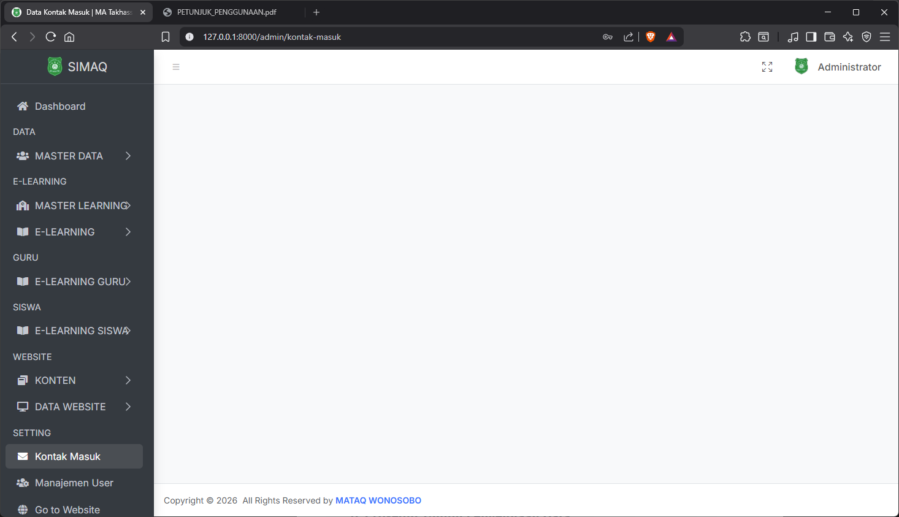
*Gambar 6: Tampilan Menu Sidebar dan Navigasi Utama*


## **6. Prosedur Umum Pengelolaan Data**

Sistem SIMAQ menyediakan fitur pengelolaan data yang bersifat universal. Prosedur-prosedur berikut berlaku untuk sebagian besar halaman pengelolaan data dalam sistem.

### **6.1. Menambah Data**

Untuk menambahkan data baru ke dalam sistem:

1. Navigasi ke halaman atau menu yang ingin ditambahkan datanya (misalnya: Menu Data → Siswa, Menu E-Learning → Modul Pelajaran, dll).

2. Pada halaman tersebut, klik tombol **Tambah** yang biasanya terletak di sebelah kanan atas halaman.

3. Halaman form input akan terbuka. Lengkapi semua kolom form dengan data yang akurat dan valid.

4. Kolom yang ditandai dengan tanda bintang (*) adalah **kolom wajib diisi**. Pastikan semua kolom wajib diisi sebelum menyimpan.

5. Untuk kolom optional (tidak bertanda *), Anda dapat mengisinya atau membiarkannya kosong sesuai kebutuhan.

6. Setelah semua data terisi, klik tombol **Simpan** atau **Tambah** untuk menyimpan data baru ke dalam sistem.

7. Sistem akan menampilkan pesan konfirmasi jika proses penyimpanan berhasil, dan data akan muncul di daftar.

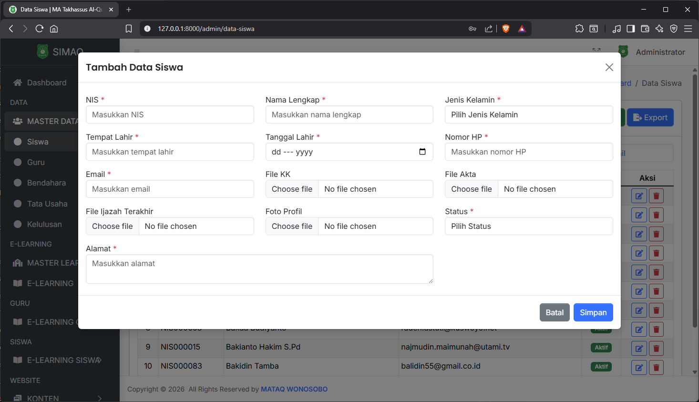
*Gambar 7: Contoh Formulir Penambahan Data Baru*

### **6.2. Mengubah atau Mengedit Data**

Untuk mengubah data yang sudah ada:

1. Buka halaman pengelolaan data yang ingin diubah.

2. Cari data yang akan diupdate menggunakan fitur **Pencarian** atau **Filter**.

3. Klik tombol **Edit** atau **Ubah** pada baris data yang ingin diubah.

4. Halaman form edit akan terbuka dengan data yang ada sudah terisi di kolom-kolom form.

5. Lakukan perubahan pada kolom yang ingin diupdate.

6. Setelah melakukan perubahan, klik tombol **Simpan** atau **Perbarui** untuk menyimpan perubahan.

7. Sistem akan menampilkan pesan konfirmasi dan data akan diperbarui di daftar.

### **6.3. Menghapus Data**

Untuk menghapus data dari sistem:

1. Buka halaman pengelolaan data yang ingin dihapus.

2. Cari data yang akan dihapus menggunakan fitur **Pencarian** atau **Filter**.

3. Klik tombol **Hapus** atau **Delete** pada baris data yang ingin dihapus.

4. Sistem akan menampilkan dialog konfirmasi penghapusan. Baca pesan konfirmasi dengan cermat.

5. Klik tombol **Ya** atau **Konfirmasi** untuk melanjutkan penghapusan, atau klik **Batal** untuk membatalkan.

6. Setelah dikonfirmasi, data akan dihapus dari sistem dan tidak bisa dikembalikan.

> **Catatan Penting**:
> - Jika tombol **Edit**, **Hapus**, atau **Detail** tidak muncul atau tidak aktif, berarti pengguna tidak memiliki hak akses (permission) untuk melakukan tindakan tersebut.
> - Hubungi **Admin** jika membutuhkan hak akses tambahan.
> - Beberapa data tertentu mungkin tidak bisa dihapus jika masih memiliki hubungan (relasi) dengan data lain di sistem.

## **7. Panduan Berdasarkan Peran Pengguna**

Sistem SIMAQ memiliki tiga tingkatan akses pengguna dengan hak dan tanggung jawab yang berbeda-beda. Panduan ini dibagi berdasarkan peran tersebut untuk memudahkan pengguna dalam mengoperasikan sistem sesuai dengan wewenang mereka.

### **7.1. ADMIN**

### **Deskripsi dan Tanggung Jawab Admin**

Admin memiliki hak akses tertinggi dalam sistem SIMAQ. Tanggungjawab utama Admin mencakup:

1. **Pengelolaan Data Akademik**: Mengelola data siswa, guru, bendahara, dan tata usaha.
2. **Pengelolaan E-Learning**: Mengatur struktur pembelajaran, modul, dan rombel.
3. **Pengelolaan Konten Website**: Mengelola berita, karya ilmiah, e-book, dan galeri.
4. **Manajemen Pengguna**: Membuat, mengaktifkan, dan menonaktifkan akun pengguna.
5. **Sistem dan Pengaturan**: Mengonfigurasi setting website dan sistem umum.

### **Menu dan Struktur Admin**

#### **7.1.1. Dashboard Admin**

Dashboard Admin menampilkan ringkasan dan statistik sistem:

* **Statistik Siswa**: Jumlah total siswa dan sebaran per tingkat/jurusan
* **Statistik Guru**: Jumlah guru dan informasi pengampu mata pelajaran
* **Statistik E-Learning**: Data pembelajaran, modul, dan absensi
* **Notifikasi dan Informasi Penting**: Alert sistem, pembaruan, dan report

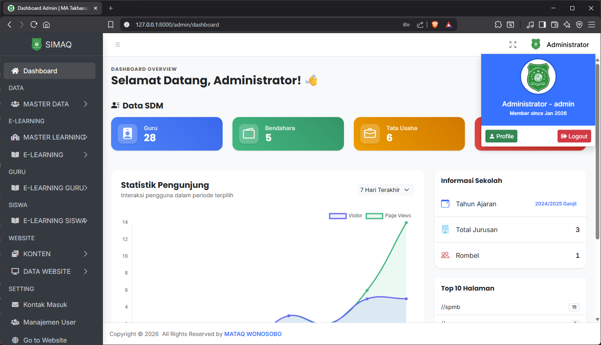
*Gambar 8: Halaman Dashboard Admin dengan Statistik Sistem*

#### **7.1.2. Menu DATA**

**Menu DATA** digunakan untuk mengelola data master akademik sekolah.

**Sub-Menu: MASTER DATA**

| Menu | Deskripsi |
|-----|-----------|
| **Siswa** | Mengelola data identitas siswa lengkap (nama, NIS, NIB, alamat, kontak wali, dll). Setiap penambahan siswa akan otomatis membuat akun user dengan password awal = NIS siswa. |
| **Guru** | Mengelola data guru pengajar (nama, NIP, alamat, kontak, sertifikat, dll). Setiap penambahan guru akan otomatis membuat akun user dengan password awal = Kode Guru. |
| **Bendahara** | Mengelola data staf bendahara sekolah dengan informasi kontak dan akses keuangan. Akun user otomatis dibuat dengan password awal = Kode Staf. |
| **Tata Usaha** | Mengelola data staf tata usaha dengan tugas administratif. Akun user otomatis dibuat dengan password awal = Kode Staf. |
| **Kelulusan** | Mengelola data siswa yang lulus, jumlah lulus, dan statistik kelulusan per tahun ajaran. |

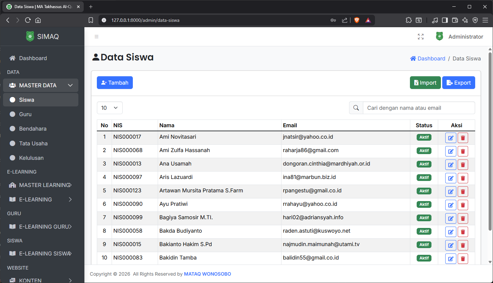
*Gambar 9: Halaman Pengelolaan Data Siswa*

> **Informasi Penting**:
> Ketika menambahkan data **Siswa, Guru, Bendahara, atau Tata Usaha** ke sistem, akun pengguna akan otomatis dibuat dalam database. Pengguna baru dapat menggunakan akun tersebut untuk login dengan password awal sesuai aturan masing-masing role:
> - **Siswa**: Password awal = **NIS** (Nomor Induk Siswa)
> - **Guru/Staf**: Password awal = **Kode/KD** (Kode Guru atau Kode Staf)
>
> Pengguna baru **harus mengubah password awal** saat login pertama kali untuk alasan keamanan.

#### **7.1.3. Menu E-LEARNING**

**Sub-Menu: MASTER LEARNING**

Menu ini digunakan untuk mengatur struktur dan fondasi pembelajaran di sistem:

| Menu | Deskripsi |
|-----|-----------|
| **Tahun Ajaran** | Mengelola periode tahun ajaran yang berlaku di sekolah, serta menentukan tahun ajaran mana yang sedang aktif. Contoh: 2024/2025, 2025/2026, dll. |
| **Tingkat Kelas** | Mengelola tingkat atau jenjang kelas yang ada (misal: X, XI, XII untuk SMA, atau I, II, III untuk SMP). Digunakan sebagai dasar pengelompokan siswa. |
| **Jurusan** | Mengelola data jurusan atau program studi yang tersedia di sekolah. Contoh: IPA, IPS, Agama, Sains, dll. |
| **Ruang Kelas** | Mengelola data ruang kelas fisik sebagai lokasi pembelajaran. Misal: Ruang 1-A, Lab Komputer, Aula, dll. |
| **Mata Pelajaran** | Mengelola daftar lengkap mata pelajaran yang diajarkan di sekolah dengan kodenya. |

**Sub-Menu: E-LEARNING**

Menu ini untuk mengelola pembelajaran aktif dan interaktif:

| Menu | Deskripsi |
|-----|-----------|
| **Pengajar** | Menugaskan guru ke mata pelajaran, rombel (kelas), dan tahun ajaran. Menu ini menghubungkan guru dengan kelas yang akan diajar. |
| **Modul Pelajaran** | Mengelola modul pembelajaran yang diunggah oleh guru. Admin dapat melihat, mengubah, atau menghapus modul. |
| **Rombel (Rombongan Belajar)** | Mengelola pengelompokan kelas (rombel) dan penempatan siswa ke dalam rombel tertentu. |

#### **7.1.4. Menu GURU (Monitoring)**

Menu ini memungkinkan Admin untuk memonitor aktivitas guru:

| Menu | Deskripsi |
|-----|-----------|
| **Mata Pelajaran Guru** | Melihat mata pelajaran apa saja yang diampu oleh setiap guru beserta rombel terkait. |
| **Modul Pelajaran Guru** | Memonitor modul yang telah dibuat dan digunakan guru dalam pembelajaran. |

#### **7.1.5. Menu SISWA (Monitoring)**

Menu ini memungkinkan Admin untuk memonitor data dan aktivitas siswa:

| Menu | Deskripsi |
|-----|-----------|
| **Mata Pelajaran Siswa** | Melihat mata pelajaran apa saja yang diikuti oleh setiap siswa. |
| **Modul Pelajaran Siswa** | Memonitor modul pembelajaran yang dapat diakses atau telah diakses siswa. |

#### **7.1.6. Menu WEBSITE**

**Sub-Menu: KONTEN**

Menu ini digunakan untuk mengelola konten publik di bagian website sekolah:

| Menu | Deskripsi |
|-------|-----------|
| **Berita** → **Daftar Berita** | Menambah, mengubah, atau menghapus berita sekolah. Pengaturan publikasi, tanggal, dan kategori berita. |
| **Berita** → **Kategori Berita** | Mengelola kategori berita untuk organisasi yang lebih baik. Contoh: Pengumuman, Kegiatan Sekolah, Prestasi, dll. |
| **Karya Ilmiah** → **Daftar Karya Ilmiah** | Mengelola publikasi karya ilmiah siswa atau guru (skripsi, makalah, penelitian, dll). |
| **Karya Ilmiah** → **Kategori Karya Ilmiah** | Mengelola kategori karya ilmiah. |
| **E-Book** | Mengelola koleksi e-book atau literatur digital yang tersedia untuk publik. |
| **Download** | Mengelola berkas-berkas yang dapat diunduh oleh pengunjung (panduan, formulir, template, dll). |
| **Galeri** | Mengelola galeri foto atau dokumentasi kegiatan sekolah. |

**Sub-Menu: DATA WEBSITE**

| Menu | Deskripsi |
|-----|-----------|
| **Data Profil** | Mengelola informasi profil sekolah/website (nama, visi misi, sejarah, alamat, kontak, logo, dll). |
| **Struktur** | Mengelola struktur organisasi sekolah (kepala sekolah, guru, staf, dll). |
| **Kontak** | Mengelola informasi kontak resmi sekolah untuk pengunjung. |

#### **7.1.7. Menu SETTING**

Menu pengaturan sistem dan manajemen pengguna:

| Menu | Deskripsi |
|-----|-----------|
| **Kontak Masuk** | Melihat dan merespons pesan atau masukan yang masuk dari pengunjung melalui formulir kontak website. (Fitur dalam pengembangan) |
| **Manajemen User** | Mengelola akun pengguna: membuat user baru, mengubah informasi, mengaktifkan/menonaktifkan akun, reset password, dll. |
| **Go to Website** | Tautan untuk melihat tampilan depan website publik sekolah. |
| **Logout** | Keluar dari sistem dan kembali ke halaman login. |

### **7.2. GURU**

### **Deskripsi dan Tanggung Jawab Guru**

Guru memiliki akses untuk mengelola pembelajaran dan materi ajar. Tanggung jawab utama Guru:

1. **Mengelola Materi Pelajaran**: Membuat dan mengelola materi/modul pembelajaran.
2. **Pencatatan Absensi**: Mencatat kehadiran siswa setiap kali pembelajaran.
3. **Monitoring Pembelajaran**: Melihat aktivitas dan perkembangan siswa dalam pembelajaran.

### **Menu Guru**

| Menu | Deskripsi |
|-----|-----------|
| **Dashboard** | Ringkasan kegiatan pembelajaran dan informasi penting untuk guru. |
| **Mata Pelajaran** | Daftar lengkap mata pelajaran dan rombel (kelas) yang diampu guru pada tahun ajaran aktif. |
| **Materi dan Absensi** | Menu untuk menambah materi pembelajaran dan mencatat absensi siswa. |
| **Modul Pelajaran** | Pengelolaan modul pembelajaran yang telah dibuat: melihat, mengubah, atau menghapus modul. |
| **Logout** | Keluar dari sistem. |

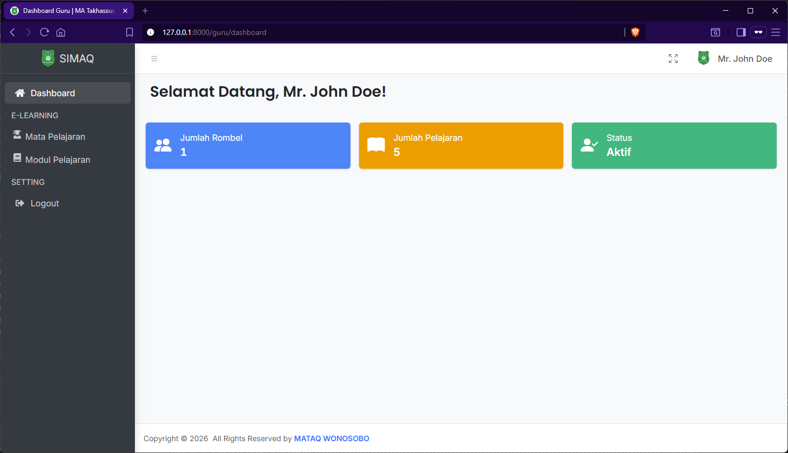
*Gambar 10: Halaman Dashboard Guru*

### **Prosedur Guru**

#### **7.2.1. Melihat Mata Pelajaran yang Diampu**

Untuk melihat daftar mata pelajaran dan kelas yang sedang diampu:

1. Login sebagai Guru ke Sistem SIMAQ.

2. Klik menu **Mata Pelajaran** pada sidebar.

3. Halaman akan menampilkan daftar semua mata pelajaran dan rombel (kelas) yang Anda ampu pada tahun ajaran yang sedang aktif.

4. Setiap baris menampilkan informasi: nama mata pelajaran, kode pelajaran, rombel/kelas, jumlah siswa, dan tombol aksi.

5. Klik pada nama pelajaran atau tombol **Detail** untuk melihat informasi lengkap kelas tersebut.

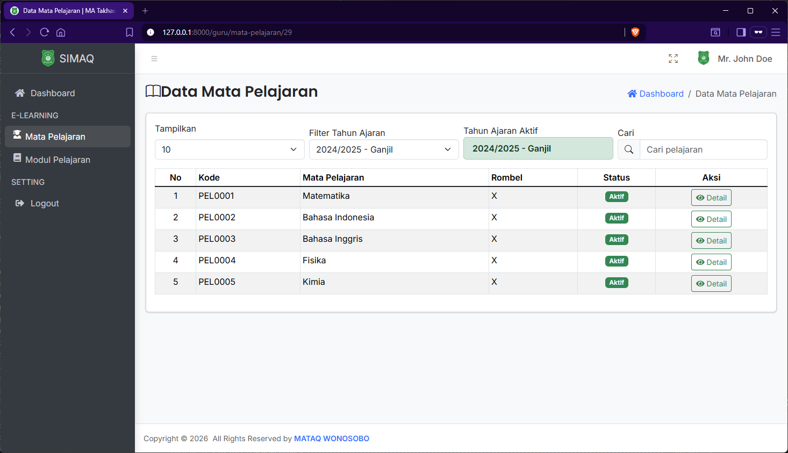
*Gambar 11: Halaman Daftar Mata Pelajaran yang Diampu Guru*

#### **7.2.2. Menambah Materi dan Mencatat Absensi**

Untuk menambahkan materi pembelajaran dan mencatat absensi siswa:

1. Klik menu **Materi dan Absensi** pada sidebar.

2. Klik tombol **Tambah Materi** untuk membuat materi pembelajaran baru.

3. Isi form dengan informasi materi:
   * Pilih **Mata Pelajaran** dan **Rombel** yang akan diajarkan
   * Isi **Judul Materi**
   * Isi **Deskripsi/Isi Materi** (gunakan text editor untuk format yang lebih baik)
   * *Opsional*: Unggah file/pembelajaran tambahan

4. Klik **Simpan** untuk menyimpan materi.

5. Setelah materi tersimpan, buka materi tersebut dan klik tab/menu **Absensi**.

6. Pada halaman absensi, pilih status kehadiran untuk setiap siswa:
   * **Hadir** (H)
   * **Sakit** (S)
   * **Izin** (I)
   * **Alpa/Tanpa Keterangan** (A)

7. Setelah mengisi semua siswa, klik **Simpan Absensi**.

8. Sistem akan menyimpan data absensi yang dapat dilihat oleh siswa sebagai informasi kehadiran.

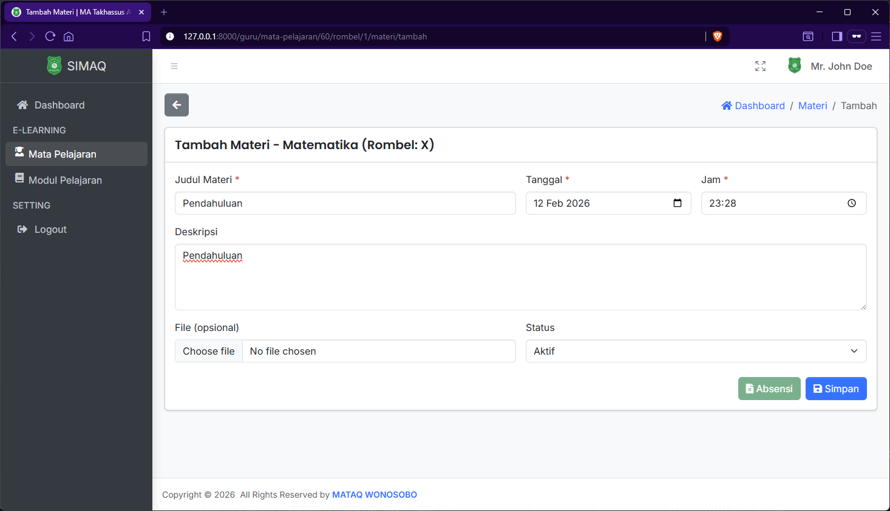
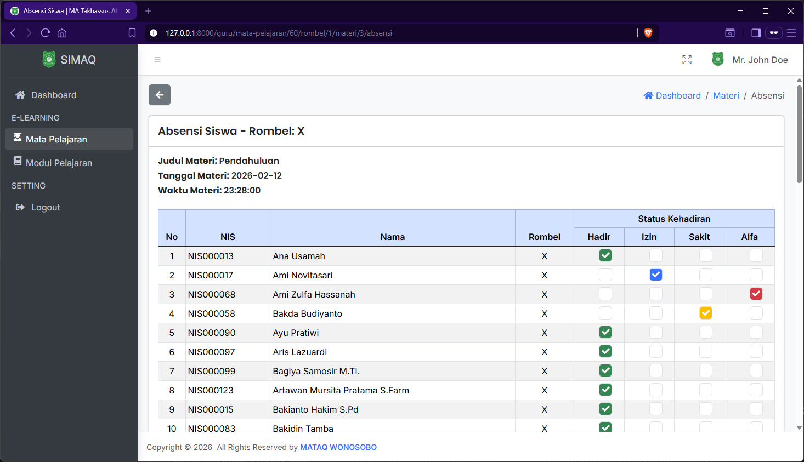
*Gambar 12: Form Penambahan Materi dan Pencatatan Absensi Siswa*

#### **7.2.3. Mengelola Modul Pelajaran**

Untuk mengelola modul pembelajaran:

1. Klik menu **Modul Pelajaran** pada sidebar.

2. Halaman akan menampilkan daftar modul yang telah Anda buat.

3. Untuk **membuat modul baru**:
   * Klik tombol **Tambah Modul**
   * Isi judul, deskripsi, dan unggah file modul (PDF, Word, Presentation, dll)
   * Klik **Simpan**

4. Untuk **mengubah modul**:
   * Klik tombol **Edit** pada modul yang ingin diubah
   * Ubah informasi atau file
   * Klik **Simpan**

5. Untuk **menghapus modul**:
   * Klik tombol **Hapus** pada modul
   * Konfirmasi penghapusan

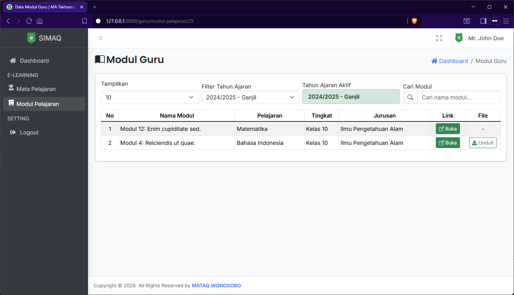
*Gambar 13: Halaman Pengelolaan Modul Pelajaran Guru*

### **7.3. SISWA**

### **Deskripsi dan Tanggung Jawab Siswa**

Siswa menggunakan Sistem SIMAQ terutama untuk mengakses materi pembelajaran dan melihat informasi akademik pribadi. Hak akses siswa:

1. **Mengakses Materi Pembelajaran**: Melihat dan mengunduh materi serta modul yang disediakan guru.
2. **Melihat Informasi Kehadiran**: Melihat data absensi dan kehadiran pribadi di setiap mata pelajaran.
3. **Memantau Jadwal Pembelajaran**: Melihat jadwal pelajaran dan informasi kelas.

### **Menu Siswa**

| Menu | Deskripsi |
|-----|-----------|
| **Dashboard** | Ringkasan informasi pembelajaran siswa dan pemberitahuan penting. |
| **Mata Pelajaran** | Daftar lengkap mata pelajaran yang sedang diikuti siswa. |
| **Materi dan Absensi** | Daftar materi pembelajaran dan informasi absensi/kehadiran pribadi. |
| **Modul Pelajaran** | Daftar modul pembelajaran yang dapat diunduh atau dibaca. |
| **Logout** | Keluar dari sistem. |


*Gambar 14: Halaman Dashboard Siswa*

### **Prosedur Siswa**

#### **7.3.1. Melihat Mata Pelajaran yang Diikuti**

Untuk melihat daftar mata pelajaran di sekolah:

1. Login sebagai Siswa ke Sistem SIMAQ.

2. Klik menu **Mata Pelajaran** pada sidebar.

3. Halaman akan menampilkan daftar lengkap mata pelajaran yang Anda ikuti pada tahun ajaran yang sedang aktif.

4. Informasi yang ditampilkan meliputi:
   * Nama mata pelajaran
   * Nama guru pengajar
   * Rombel (kelas)
   * Jadwal pembelajaran
   * Jumlah materi tersedia

5. Klik pada nama pelajaran untuk melihat detail lebih lanjut atau materi yang tersedia.

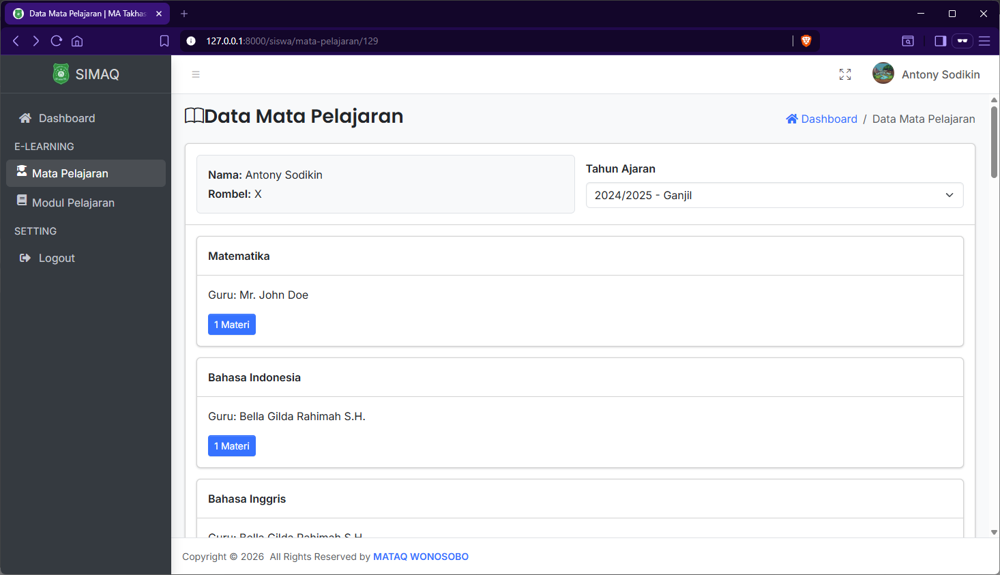
*Gambar 15: Halaman Daftar Mata Pelajaran Siswa*

#### **7.3.2. Mengakses Materi dan Melihat Absensi**

Untuk mengakses materi pembelajaran dan melihat kehadiran:

1. Klik menu **Materi dan Absensi** pada sidebar.

2. Sistem akan menampilkan daftar semua materi pembelajaran yang telah diunggah oleh guru-guru Anda.

3. Setiap materi menampilkan:
   * Tanggal materi dibuat
   * Mata pelajaran terkait
   * Guru pengajar
   * Status kehadiran Anda untuk materi tersebut

4. Untuk **melihat/membaca materi**:
   * Klik pada judul materi
   * Halaman detail materi akan terbuka dengan isi/deskripsi lengkap
   * Jika ada file yang dilampirkan, Anda dapat mengunduhnya

5. Untuk **melihat absensi**:
   * Pada daftar materi, lihat kolom **Status Kehadiran** untuk mengetahui status Anda pada waktu pembelajaran tersebut
   * Status kemungkinan: Hadir (H), Sakit (S), Izin (I), atau Alpa (A)

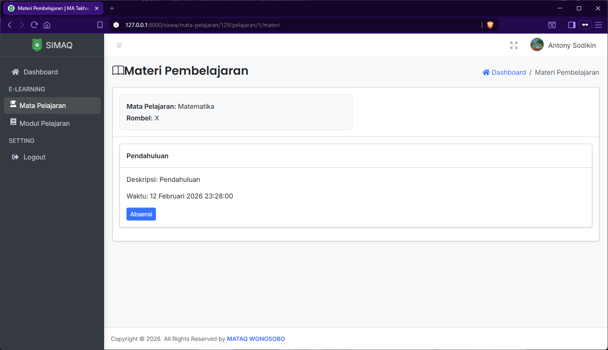
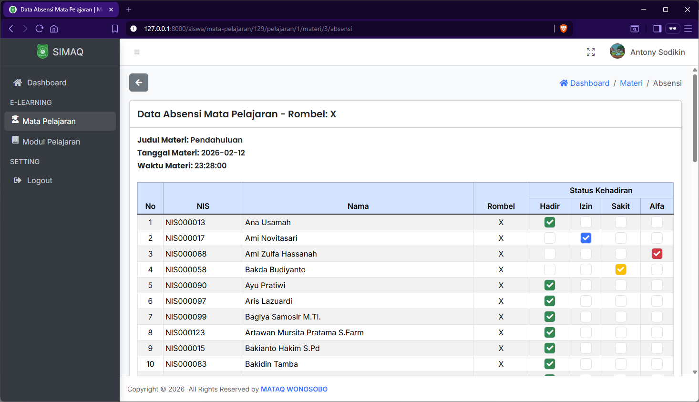
*Gambar 16: Halaman Materi Pembelajaran dan Informasi Absensi Siswa*

#### **7.3.3. Mengakses Modul Pelajaran**

Untuk mengakses dan mengunduh modul pembelajaran:

1. Klik menu **Modul Pelajaran** pada sidebar.

2. Sistem akan menampilkan daftar lengkap modul pembelajaran dari semua mata pelajaran yang Anda ikuti.

3. Setiap modul menampilkan:
   * Judul modul
   * Deskripsi singkat
   * Mata pelajaran terkait
   * Guru pembuat modul
   * Tanggal publikasi

4. Untuk **membaca modul online** (jika tersedia):
   * Klik tombol **Baca** atau **Preview**
   * Modul akan terbuka dalam viewer online

5. Untuk **mengunduh modul**:
   * Klik tombol **Unduh** atau **Download**
   * File modul akan diunduh ke komputer/perangkat Anda
   * Simpan file tersebut untuk dipelajari kemudian

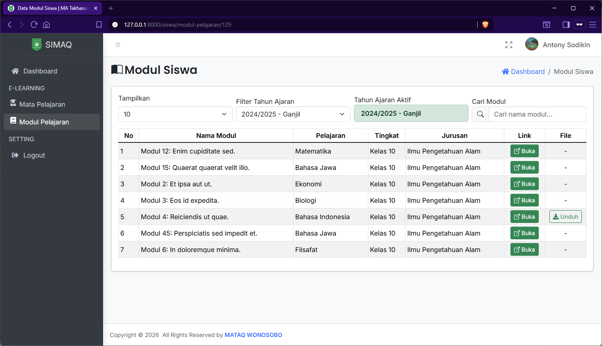
*Gambar 17: Halaman Daftar Modul Pelajaran untuk Siswa*

## **8. Prosedur Logout (Keluar Sistem)**

Logout adalah prosedur keluar dari Sistem SIMAQ dengan aman. Penting dilakukan setelah selesai menggunakan sistem, terutama pada komputer publik.

### **Langkah-Langkah Logout**

1. Setelah selesai menggunakan sistem, identifikasi lokasi menu **Logout** pada sidebar atau navbar (biasanya terletak di bagian bawah sidebar atau di menu profil di navbar).

2. Klik menu **Logout**.

3. Sistem akan menampilkan dialog atau pesan konfirmasi logout.

4. Klik tombol **Ya** atau **Konfirmasi** untuk mengonfirmasi logout.

5. Sesi pengguna akan dihentikan dan sistem akan mengarahkan kembali ke **halaman login**.

6. Akses ke sistem telah dihentikan. Untuk mengakses kembali, perlu login ulang dengan email dan password.

> **Catatan Keamanan**:
> - Selalu logout setelah selesai menggunakan sistem.
> - Logout sangat penting ketika menggunakan komputer publik atau komputer bersama.
> - Jangan meninggalkan komputer dalam kondisi login (untuk mencegah akses tidak sah).
> - Jika lupa logout, Anda dapat logout dari perangkat lain atau meminta bantuan Admin untuk reset sesi.

## **9. Bantuan dan Dukungan Teknis**

Apabila pengguna mengalami kendala teknis, masalah login, atau pertanyaan dalam menggunakan Sistem SIMAQ, berikut adalah langkah-langkah yang disarankan:

### **Langkah-Langkah Troubleshooting Dasar**

1. **Masalah Akses/Login**:
   * Periksa kembali email dan password yang diinputkan (case-sensitive)
   * Pastikan CapsLock tidak aktif
   * Clear browser cache dan cookies: Tekan `Ctrl + Shift + Delete`
   * Coba gunakan browser lain (Chrome, Firefox, atau Edge)
   * Gunakan fitur "Lupa Password" untuk reset password jika masalah berlanjut

2. **Halaman Tidak Memuat atau Loading Lambat**:
   * Periksa koneksi internet Anda
   * Refresh halaman: Tekan `F5` atau `Ctrl + R`
   * Tunggu beberapa saat untuk proses loading
   * Jika masalah berlanjut, hubungi IT Support

3. **Error atau Pesan Khusus**:
   * Catat pesan error yang muncul (screenshot jika memungkinkan)
   * Hubungi Tim IT dengan menyertakan informasi error tersebut

### **Kontak Dukungan Teknis**

Jika masalah tidak teratasi dengan troubleshooting dasar, silakan menghubungi:

| Kontak | Keterangan |
|--------|-----------|
| **Admin Sekolah** | Untuk masalah terkait hak akses, data pribadi, atau aktivasi akun |
| **Tim IT / Developer** | Untuk masalah teknis sistem, error, atau performance |
| **Email Support** | xxxxxxxx@gmail.com |
| **WhatsApp** | 08xxxxxxxxxxx |

### **Informasi yang Perlu Disiapkan saat Melaporkan Masalah**

Persiapkan informasi berikut saat menghubungi support untuk memudahkan penyelesaian masalah:

1. Nama dan peran pengguna (Admin/Guru/Siswa)
2. Deskripsi detail masalah yang dialami
3. Langkah-langkah yang dilakukan sebelum error terjadi
4. Pesan error lengkap (jika ada)
5. Screenshot halaman yang error (jika memungkinkan)
6. Browser dan sistem operasi yang digunakan (Windows/Mac/Linux, Chrome/Firefox/Edge)
7. Tanggal dan waktu kejadian

## **10. Informasi Dokumentasi**

| Keterangan | Informasi |
|-----------|-----------|
| **Versi Dokumen** | 1.0 |
| **Tanggal Penyusun** | Februari 2026 |
| **Tim Penyusun** | Developer - Toha Safingi |
| **Status** | Resmi dan Final |
| **Update Terakhir** | Februari 2026 |

---

### **Catatan dan Disclaimer**

* Dokumen ini adalah panduan resmi penggunaan Sistem SIMAQ dan berlaku untuk semua pengguna di MA Takhassus Al-Qur'an Wonosobo.
* Konten dokumen dapat berubah sesuai dengan perkembangan atau update sistem.
* Pengguna diharapkan membaca dan memahami panduan ini sebelum menggunakan sistem.
* Pertanyaan atau masukan terkait panduan dapat disampaikan kepada Tim IT.
* Untuk fitur-fitur terbaru atau update sistem, silakan hubungi Tim IT secara berkala.

**© 2026 Toha Safingi. All Rights Reserved.**


